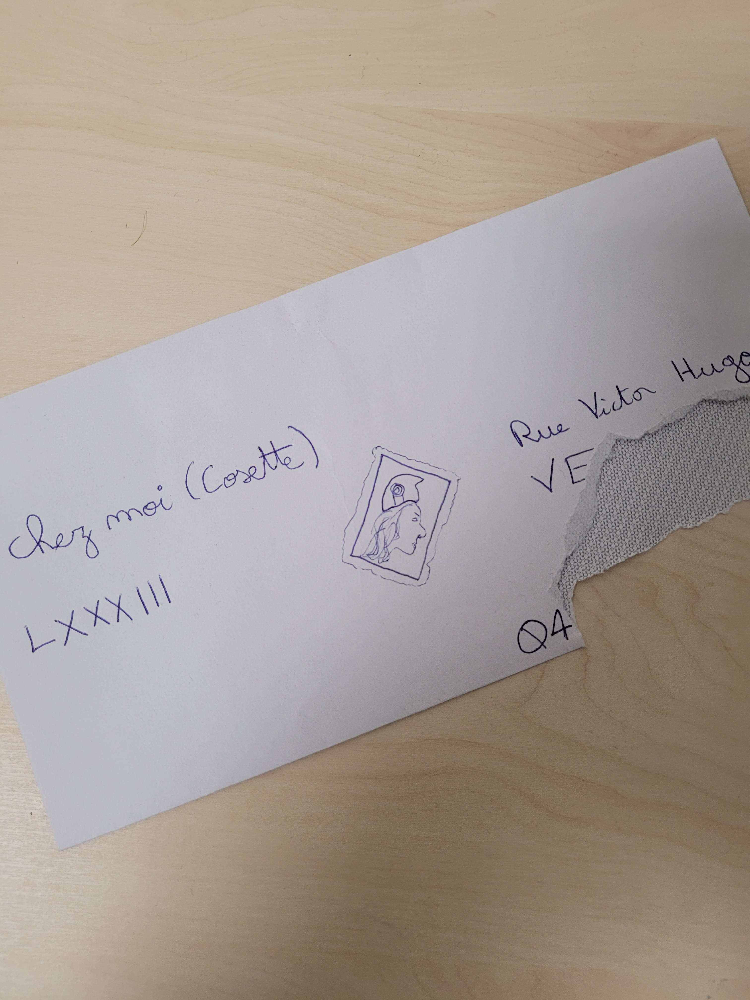

    En pleine discussion au Procope, Cosette vous raconte autour d'une part de fraisier la première fois qu'elle a essayé d'envoyer une lettre à son bienfaiteur : Jean Valjean.
    
    Débutante dans la démarche postale, elle s'est trompée sur les informations nécessaires, elle en a même oublié l'adresse du destinataire, n'écrivant que la sienne.
    Elle vous montre la photo ci-jointe et vous met au défi de trouver d'où elle l'a écrite. 

On nous donne cette photo:

En tapant "Rue Victor Hugo, Ve" sur Google Maps, on tombe sur plusieurs options. On peut également apercevoir sur la photo un indicateur téléphonique en 04, ce qui nous permet de réduire les options au quart Sud-Est de la France.

Une fois la ville trouvée, on peut déterminer le numéro exact en déchiffrant le numéro latin LXXXIII.

