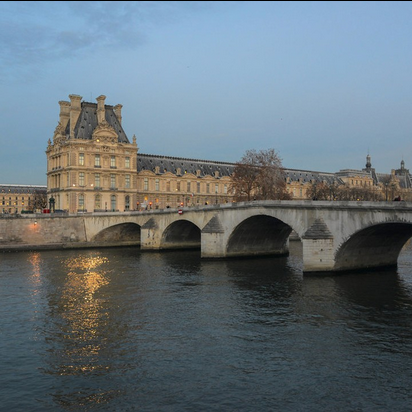

    Vous entendez de l'agitation dans le café, la commissaire Anne Capestan ainsi que sa brigade des Poulets Grillés sont sur une enquête traitant d’emplois fictifs et il est nécessaire de retracer les pas des grands acteurs de cette arnaque.
    La brigade, qui a pourtant la réputation d'être d'une efficacité redoutable malgré les personalités fortes qui la compose, n'arrive pas à avancer dans l'enquête.
    Vous êtes conviés à apporter un regard nouveau à ce qui semble être une chasse à l'homme ou plutôt une chasse à la femme dans ce cas précis...
    La principale suspecte se prénommerait Margot Paquet, si ce n'est pas un pseudonyme...
    Nous savons qu’elle est allée au restaurant peu de temps avant de totalement disparaître, trouvez le nom du restaurant et le prix qu’elle y a payé pour aider l'enquête à avancer.
    Anne a besoin de vous, elle doit redorer son blason après sa sanction pour utilisation d'armes abusive, faites au mieux !

Après quelques recherches sur les plus gros réseaux sociaux, on trouve rapidement le compte de Margot Paquet sur Instagram dont les posts datent de juste avant le début du CTF https://www.instagram.com/margot.paquet/tagged/.

On peut voir sur son profil 7 photos de plats postées à des dates différentes et on voit qu'elle a été mentionnée par le compte https://www.instagram.com/futurionix/.

Sur le compte Futurionix, on apprend que le diner avec Margot a eu lieu le 26 avril juste devant cette photo:

On peut reconnaitre le Louvres et on peut retrouver sur Google Maps le restaurant "La Frégate" qui se trouve en face, il ne nous reste plus qu'à trouver le prix du repas.

En analysant en détail les descriptions des photos du compte Instagram de Margot, on peut voir que le 27 elle dit avoir mangé une tarte tatin le jour d'avant et parmi le reste des photos du 26 avril, elle précise que le boeuf bourguignon est son "go to au restaurant quand il est à moins de 15€".

Sur Google Maps on peut retrouver une carte du restaurant dans les avis et additionner les prix de ces deux éléments pour trouver la somme finale (le menu The Fork décrit le boeuf bourguignon à plus de 15 euros ce qui implique qu'il faut trouver le menu dans les photos Google maps).