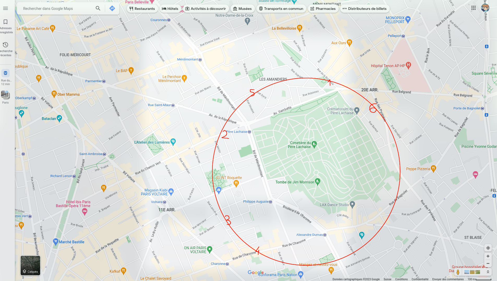

    Vous êtes tranquillement assis dans le café litteraire, quand quelqu'un s'approche de vous et commence à vous parler :
    « Connaissez vous l'histoire d'Arsène Lupin ? Non ? Et bien remédions à cela. Arsène Lupin est un gentleman cambrioleur.
    Il est très doué dans son domaine, en particulier dans l'art du déguisement et de l'usurpation d'identité.
    C'est grâce à ses nombreux talents qu'il a réussis certains des plus grands casses n'ayant jamais vu le jour : il a notamment récupéré la dalle des rois de Bohême ou encore escroqué le crédit lyonnais.
    Cependant, un mystère demeure : où cache-t-il ses butins ?
    Sachez que récemment, Arsène Lupin a été aperçu et pris en filature...
    Je n'ai malheureusement pas le temps de me pencher sur cette affaire, mais peut-être que vous, vous pourrez trouver le lieu où il cache ses trésors. »

On nous donne les 6 photos suivantes:

 
Avec de rapides recherches sur Google Maps, on peut retrouver les lieux suivants:

Avec une carte précise comme celle-ci on peut retrouver le lieu précis au centre du cercle (plus précis que le cimetière) tracé par les 6 points pour trouver la cachette d'Arsène Lupin.